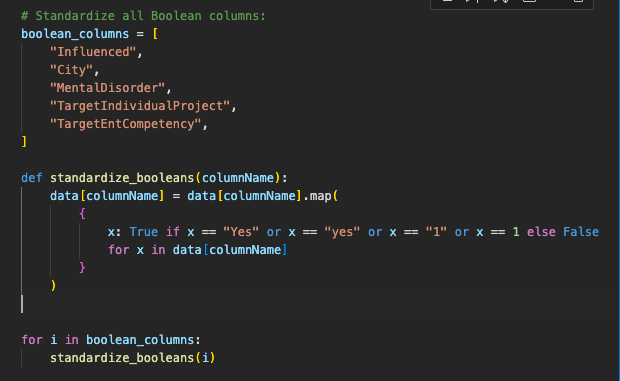
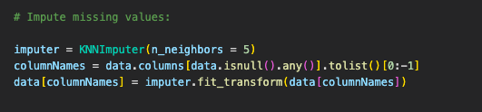
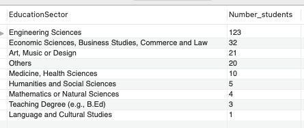
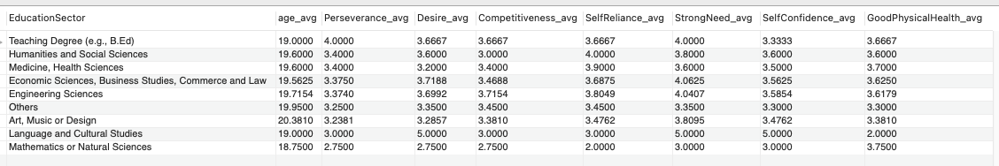

# **Data cleaning**

How to prepare and cleanup data about future entrepreneurs 💪🧹🧼

Louis, Huyen

--- 

# Dataset:

Excel file with information about The Entrepreneurial Competency in University Students.

There are 219 students in diffirent sectors of education participated in the survey. 

The mesurement is based on their Age, Gender, Perseverance, Desire to take Initiative, Competitiveness, Self Reliance, Strong Need To Achieve, Self Confidence, Good Physical Health etc...

---
# How things went

- Setting up git
- Looking for duplicates, missing values and removing them
    - There is no ID data (name or customerId), so there is no way to know if duplicates are actual data errors or simply redundant data.
- Turning every "Yes/No" and "1/0" into booleans
- Changing male/female to M/F

---
- Handling "unknown"s in "City", "Influenced", "MentalDisorder, "TargetIndividualProject" and "TargetEntCompetency":
    - Are there a lot of them? If not, replacing them with "No" - If yes, turning the whole column to a 3-values column.

        
---
- Filling the missing values using KNNImputer

    
   
- Turning every float into integers
- Formatting column names to PascalCase
- Writing python script
- Exporting data to csv
- Writing SQL
- Analyzing our data 🤓 --> Presentation

--- 
# What we learnt from our data:
   - Using GROUP BY, ORDER BY and AVG from MySQL 

---
# Improvements
- Data Cleaning
- Some regexes

# Comparison of the initial and final dataset
- The initial dataset has 198 missing values
- Final datadet is neat with good information in decision making.

---
# <!--fit--> Thank you 🙏❤️

